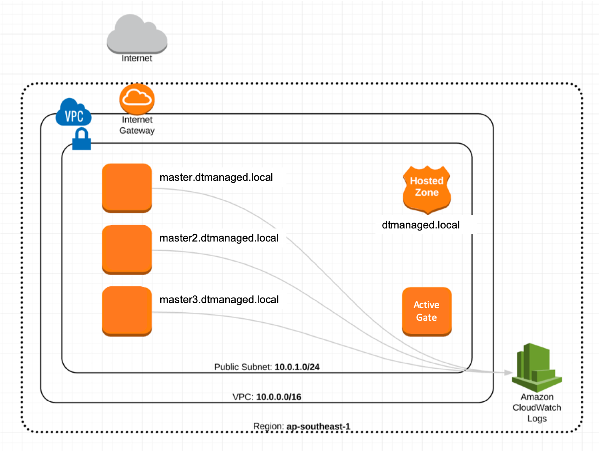

# terraform-dtmanaged

## Overview

Terraform is used to create infrastructure as shown:



Once the infrastructure is set up an inventory of the system is dynamically
created, which is used to install the Dynatrace Managed cluster on the hosts with an ActiveGate.

## Prerequisites

You need:

1. [Dynatrace Managed](https://www.dynatrace.com/support/help/get-started/get-started-with-dynatrace-managed/) subscription
2. [Terraform (0.12 or greater)](https://www.terraform.io/intro/getting-started/install.html) - `brew update && brew install terraform`
3. An AWS account, configured with the cli locally -
```
if [[ "$unamestr" == 'Linux' ]]; then
        dnf install -y awscli || yum install -y awscli
elif [[ "$unamestr" == 'FreeBSD' ]]; then
        brew install -y awscli
fi
```
4. configure the following files to meet your specific needs:
- [variables.tf](./variables.tf)
  - update aws "region"
  - update "dtmanaged_user"
  - update "dtmanaged_user_email"
  - update "dtmanaged_workshop" 
- [00-variables.tf](./modules/dtmanaged/00-variables.tf)
  - update "dtmanaged_user"
  - update "dtmanaged_user_email"
  - update "dtm_workshop"

## Creating the Cluster

Create the infrastructure first:

```bash
# Make sure ssh agent is on, you'll need it later.
eval `ssh-agent -s`

# Create the infrastructure.
make infrastructure
```

To configure which region in AWS will be used you can configure this in [`variables.tf`](./variables.tf).  You may use `us-east-1` or your preferred region. You can configure the nuances of how the cluster is created in the [`main.tf`](./main.tf) file. Once created, you will see a message like:

```
$ make infrastructure
var.region
  Region to deploy the cluster into

  Enter a value: ap-southeast-1

...

Apply complete! Resources: 20 added, 0 changed, 0 destroyed.
```

That's it! The infrastructure is ready and you can install OpenShift. Leave about five minutes for everything to start up fully.

## Installing Dynatrace Managed

To install Dynatrace Managed into the cluster, just run:

```bash
make dtmanaged
```

You will be asked to accept the host key of the bastion server (this is so that the install script can be copied onto the cluster and run), just type `yes` and hit enter to continue.

Once the setup is complete, just run:

```bash
make browse-dtmanaged
```

To open a browser to admin console, use the following credentials to login:

```
Username: tbd
Password: tbd
```

## Accessing and Managing Dynatrace Managed

### Dynatrace Managed Web Console

You can log into the OpenShift console by hitting the console webpage:

```bash
make browse-dtmanaged

# the above is really just an alias for this!
open $(terraform output dtmanaged-url)
```

The url will be something like `https://a.b.c.d.xip.io:8443`.

## Additional Configuration

The easiest way to configure is to change the settings in the [./inventory.template.cfg](./inventory.template.cfg) file.


## Destroying the Cluster

Bring everything down with:

```
terraform destroy
```

This will first attempt to unregister your Dynatrace Managed license and then destroy the cluster.  If it fails to unregister, you must request this directly with Dynatrace to re-use the license

## Makefile Commands

There are some commands in the `makefile` which make common operations a little easier:

| Command                 | Description                                     |
|-------------------------|-------------------------------------------------|
| `make infrastructure`   | Runs the terraform commands to build the infra. |
| `make dtmanaged`        | Installs Dynatrace Managed on the infrastructure.       |
| `make browse-dtmanaged` | Opens the Dynatrace Managed console in the browser.     |
| `make ssh-activegate`      | SSH to the bastion node.                        |
| `make ssh-dtmanaged`       | SSH to the master node.                         |

## Pricing

You'll be paying for:

- 1 x t3.2xlarge instance
- 1 x t2.small instance

